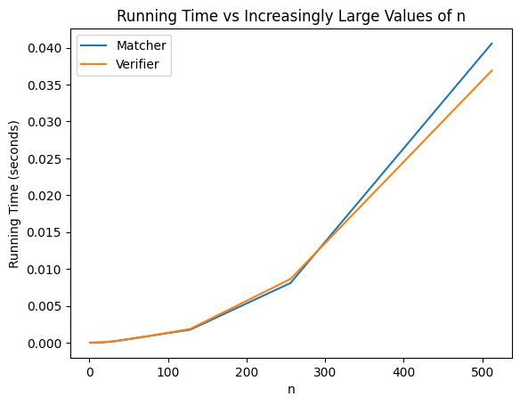

# COP4533 Programming Assignment 1
Thurstan Ngo - 86963382  
Syed Rahman - 

## Running the Matcher and Verifier
Type `python3 matcher_verifier.py` into the terminal to run the program
* This program has 2 modes: matcher and verifier
  * When prompted, type 1 for the matcher or 2 for the verifier; follow the additional prompts if needed  

Run `diff ex_out.txt output.txt` to compare the example output file and the output file created by the matcher

## Assumptions
* There are 2n lines after the first line of the input file
* For the input file, the first n lines are the hospitals' preference lists and the next n lines are the students' preference lists

## Task C
